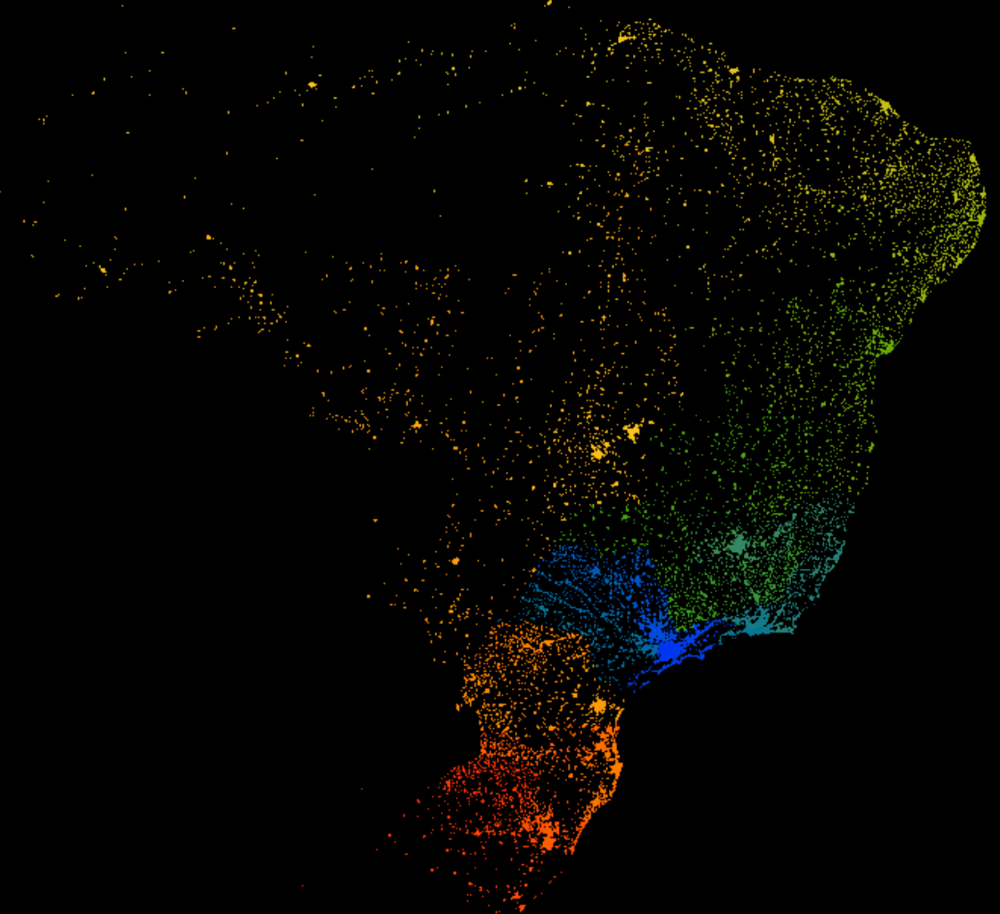
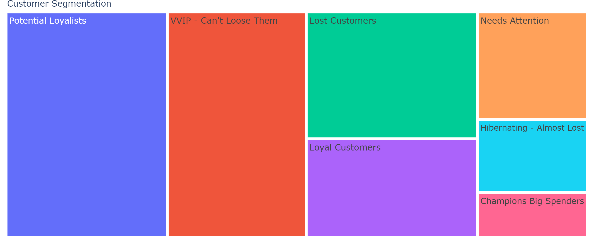

# Olist Marketing Analytics: RFM Modeling, Customer Segmentation & Upselling, Targeted Recommendations, Sentiment Analysis

## Olist Marketing Analytics 

Một hệ thống Data Driven Algorithmic Marketing cho Olist, sàn thương mại điện tử lớn nhất Brazil, Customer Segmentation, RFM & Uplift Modeling, Targeted Recommendations và Cross-Selling sử dụng Targeted Recommendations.

Marketing Analytics tại Olist giúp đo lường, quản lý và phân tích hiệu quả tiếp thị để tối đa hóa hiệu quả và tối ưu hóa ROI. Hiểu rõ Marketing analytics cho phép Olist giảm thiểu lãng phí ngân sách tiếp thị web bằng cách phân bổ ngân sách cho các chiến dịch mục tiêu, bỏ lỡ cơ hội do không thể hiển thị các đề xuất được cá nhân hóa theo sở thích của người dùng.

## Approach

1. Chúng tôi bắt đầu với EDA và Trend Analysis về Sản phẩm và Khách hàng để thu thập thông tin chi tiết cho nhà phân tích kinh doanh.
2. Sau đó, chúng tôi phân khúc khách hàng thành các cụm cụ thể dựa trên Cohort Analysis, RFM Modeling sử dụng hành vi mua hàng của họ. Đo lường MOCP/MICP (Marketing Influenced Customer Percentage).
3. Tiếp theo, chúng tôi sử dụng uplift/persuasion modeling để xác định khách hàng nào cần được chăm sóc và xác định cơ hội Upselling & Cross Selling.
4. Dự đoán giá trị trọn đời của khách hàng (LTV).
5. Đề xuất được cá nhân hóa bằng cách sử dụng phản hồi ngầm dưới dạng lịch sử mua hàng của khách hàng và phản hồi rõ ràng dưới dạng đánh giá sản phẩm của họ. Chúng tôi đã sử dụng Alternative Least Squares (ALS) và Doc2Vec để tạo 2 nhóm kiểm soát khác nhau để cung cấp đề xuất. Người dùng mới sẽ thấy các đề xuất phổ biến và sử dụng Phân khúc, chúng tôi sẽ xác định ai là Người chi tiêu lớn và sẽ Upsell họ bằng các đề xuất sản phẩm được đánh giá cao nhất.
6. Chúng tôi đã tạo 3 personas khác nhau cho front end và trình bày kết quả dưới dạng bảng điều khiển Marketing cũng như Webapp được triển khai đầy đủ.

## Personas 

1. Ban điều hành cấp cao - Marketing Dashboard 
* Để có cái nhìn tổng quan về các cohort và chỉ số doanh thu theo sản phẩm, ngày trong tuần và tháng. 
* Để xem xét tổng thể các phân khúc khách hàng để đánh giá tình hình hoạt động tiếp thị.

2. Chuyên gia phân tích dữ liệu Marketing & Hệ thống tự động: 
* Xây dựng chiến lược quảng bá dựa trên Marketing Insights và Uplift 
* Đề xuất sản phẩm cho khách hàng dựa trên sở thích của họ cùng với bất kỳ cơ hội Upselling và Cross-Selling nào 
* Tối ưu hóa Marketing Funnel để tăng doanh thu, cung cấp các Targeted Recommendations

3. End Users or Potential Customers:
* Khám phá các sản phẩm được hệ thống đề xuất
* Nhận các chương trình khuyến mãi dựa trên mức độ trung thành và nhân khẩu học của họ
* Khám phá các sản phẩm tương tự với những gì họ sắp mua hoặc đã mua trước đây

## Customer Segmentation and RFM Modeling 

Sử dụng phân tích RFM và K-means Clustering, chúng tôi đã tạo ra các cụm hoặc phân khúc khách hàng dưới đây để tiếp tục đưa ra các đề xuất mục tiêu cho họ.

1. Potential Loyalists (Khách hàng tiềm năng trung thành) —
Có tiềm năng cao trở thành khách hàng trung thành, tại sao không tặng một số quà tặng miễn phí cho lần mua hàng tiếp theo của họ để cho thấy rằng bạn coi trọng họ!

2. Needs Attention (Cần quan tâm) —
Cho thấy các dấu hiệu hứa hẹn với số lượng và giá trị mua hàng của họ, nhưng đã một thời gian kể từ lần cuối họ mua hàng từ bạn. Hãy nhắm mục tiêu họ bằng các mặt hàng trong danh sách mong muốn của họ và giảm giá trong thời gian giới hạn.

3. Hibernating Almost Lost (Gần như mất liên lạc) —
Đã thực hiện một số giao dịch mua ban đầu nhưng đã không thấy họ kể từ đó. Đó có phải là trải nghiệm khách hàng tồi tệ? Hay sự phù hợp giữa sản phẩm và thị trường? Hãy dành một số nguồn lực để xây dựng nhận thức về thương hiệu của chúng tôi với họ.

4. Lost Customers (Khách hàng đã mất) —
Những người có hiệu suất kém nhất trong mô hình RFM của chúng tôi. Họ có thể đã chuyển sang đối thủ cạnh tranh của chúng tôi ngay bây giờ và sẽ yêu cầu một chiến lược kích hoạt khác để thu hút họ trở lại.

# Installation

`git clone https://github.com/n1ml03/Olist-Marketing-Analytics.git`

`cd Olist-Marketing-Analytics`

`pip3 install -r requirements.txt`

### Download rslp stem
`curl -OL https://raw.githubusercontent.com/nltk/nltk/develop/nltk/stem/rslp.py`

`mkdir stemmers & mv rslp.py stemmers/`

`mv stemmers/ /usr/local/share/nltk_data/`

### Run project

`cd 4.\ Streamlit\ Analytics\ Dashboard/`

`python3 main.py`

